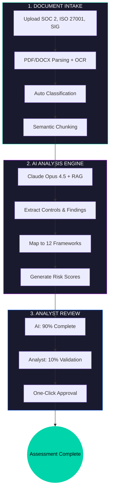
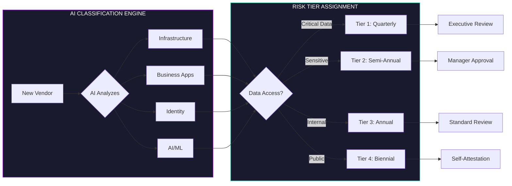
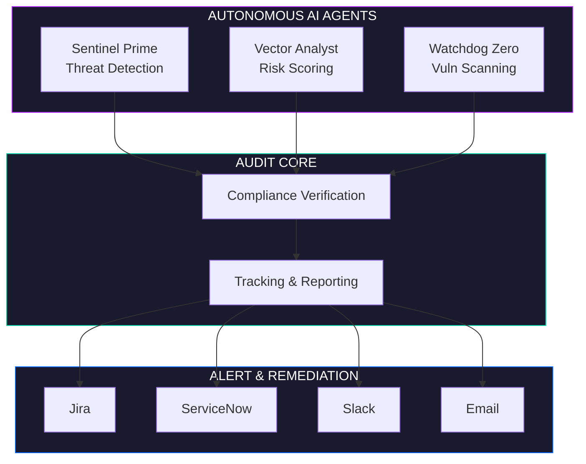
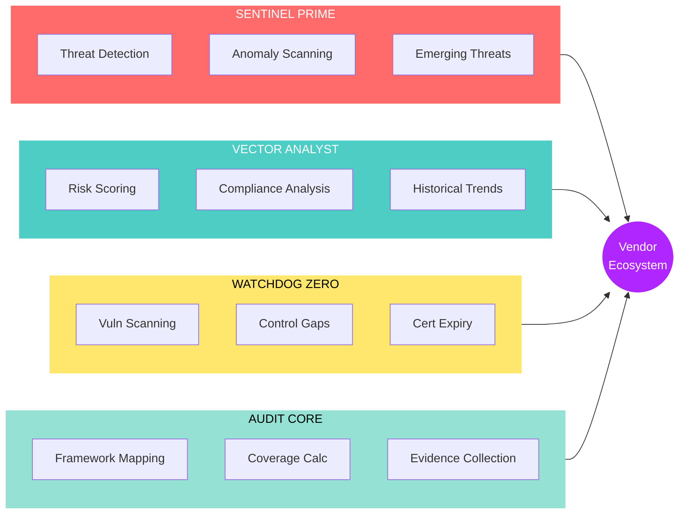
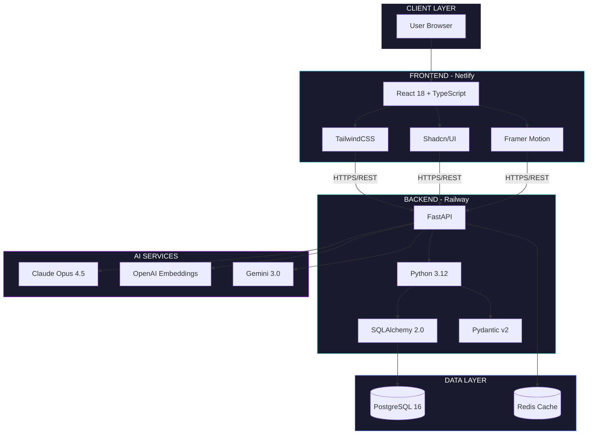

<p align="center">
  
  
</p>

<h1 align="center">VendorAuditAI</h1>

<h3 align="center">Enterprise AI-Powered Third-Party Risk Management</h3>

<p align="center">
  <em>Transform vendor security assessments from 8 hours to 15 minutes</em>
</p>

<br>

<p align="center">
  <a href="https://vendor-audit-ai.netlify.app">
    
  </a>
  &nbsp;&nbsp;
  <a href="https://vendorauditai-production.up.railway.app/docs">
    
  </a>
</p>

<br>

<p align="center">
  <a href="https://github.com/MikeDominic92/VendorAuditAI/actions/workflows/ci.yml"></a>
  <a href="https://vendorauditai-production.up.railway.app/health"></a>
  
  
</p>

<p align="center">
  
  
  
  
  
</p>

<p align="center">
  
  
  
  
</p>

<br>

---

<br>

<h2 align="center">Demo Access</h2>

<br>

<div align="center">

| Platform | Details |
|:--------:|:--------|
| **URL** | [vendor-audit-ai.netlify.app](https://vendor-audit-ai.netlify.app) |
| **Email** | `newdemo@vendorauditai.com` |
| **Password** | `Demo12345` |

</div>

<br>

---

<br>

<h2 align="center">The Problem We Solve</h2>

<br>

<div align="center">

| Challenge | Industry Impact |
|:----------|:----------------|
| **60% of data breaches** | Originate from third-party vendors |
| **$4.88M average cost** | Per data breach in 2024 |
| **6-8 hours per vendor** | Manual SOC 2 report review time |
| **200+ page documents** | Critical risks buried in dense text |

</div>

<br>

<h3 align="center">Our Solution</h3>

<br>

<div align="center">

| Capability | Result |
|:-----------|:-------|
| **AI Document Analysis** | 15-minute assessments vs 8 hours |
| **Multi-Framework Mapping** | One document mapped to 12 frameworks |
| **Autonomous Agents** | 24/7 threat detection and monitoring |
| **Natural Language Q&A** | Ask questions, get cited answers |

</div>

<br>

---

<br>

<h2 align="center">Third-Party Risk Management Portfolio 2026</h2>

<p align="center">
  <em>AI-Powered Solutions for Enterprise TPRM Challenges</em>
</p>

<br>

---

<h3 align="center">Challenge 1: Scaling Vendor Assessments</h3>

<br>

<p align="center">
  <em>"How do you assess 500+ vendors annually when each SOC 2 report takes 6-8 hours to review manually?"</em>
</p>

<br>

<h4 align="center">The Problem</h4>

<p align="center">
Enterprise organizations onboard dozens of new vendors monthly. Each requires security assessment<br>
against multiple frameworks. Manual review doesn't scale: hire more analysts (expensive) or accept risk (dangerous).
</p>

<br>

<h4 align="center">Solution Architecture</h4>



<p align="center">
<strong>Result: 6-8 hours reduced to 15 minutes per assessment</strong>
</p>

<br>

<h4 align="center">Business Results</h4>

<div align="center">

| Metric | Before | After | Impact |
|:------:|:------:|:-----:|:------:|
| Assessment time | 6-8 hours | 15 minutes | **-97%** |
| Analyst capacity | 50 vendors/year | 500+ vendors/year | **+900%** |
| Consistency | Variable | Standardized | **100%** |
| Cost per assessment | $400+ | <$50 | **-87%** |

</div>

<br>

---

<h3 align="center">Challenge 2: Vendor Categorization and Risk Tiering</h3>

<br>

<p align="center">
  <em>"How do you categorize hundreds of vendors into meaningful risk tiers?"</em>
</p>

<br>

<h4 align="center">Solution Architecture</h4>



<br>

---

<h3 align="center">Challenge 3: AI/ML Vendor Risk</h3>

<br>

<p align="center">
  <em>"How do you assess AI vendors when traditional frameworks don't cover autonomous systems?"</em>
</p>

<br>

<div align="center">

| Question | Risk Category |
|:---------|:-------------:|
| Does the AI train on customer data? | Data Privacy |
| Can the AI take autonomous actions? | Operational Risk |
| What's the blast radius if the AI hallucinates? | Business Impact |
| Who's liable for AI-generated outputs? | Legal/Compliance |

</div>

<br>

<h4 align="center">Platform Implementation</h4>

<div align="center">

| Module | Capability |
|:------:|:-----------|
| AI Tool Classification | Dedicated module for AI vendor categorization |
| NIST AI RMF Framework | 70+ controls specific to AI/ML systems |
| AI Governance Playbooks | Step-by-step workflows for AI tool adoption |
| Approved AI Registry | Pre-approved tools with deployment tracking |

</div>

<br>

---

<h3 align="center">Challenge 4: Continuous Monitoring</h3>

<br>

<p align="center">
  <em>"A SOC 2 report is a snapshot. How do you know if a vendor's security has degraded?"</em>
</p>

<br>

<h4 align="center">AI Agent Monitoring Network</h4>



<br>

---

<h3 align="center">Challenge 5: BPO and Fourth-Party Risk</h3>

<br>

<p align="center">
  <em>"Your vendor outsources to another vendor. How do you assess the risk?"</em>
</p>

<br>

<div align="center">

| Module | Capability |
|:------:|:-----------|
| BPO Module | Dedicated management for outsourcing relationships |
| Process-Level Assessment | Risk scoring per outsourced function |
| Geographic Tracking | Location-based compliance mapping |
| Fourth-Party Visibility | Track subcontractor chains |

</div>

<br>

---

<h3 align="center">Challenge 6: Executive Reporting</h3>

<br>

<p align="center">
  <em>"How do you show the board that TPRM investment prevents breaches?"</em>
</p>

<br>

<div align="center">

| Module | Capability |
|:------:|:-----------|
| Executive Dashboard | Real-time risk posture visualization |
| Trend Analysis | Historical risk score tracking |
| Exportable Reports | Board-ready PDF/CSV exports |
| Audit Trail | Complete evidence for compliance audits |

</div>

<br>

---

<br>

<h2 align="center">AI Agent Network</h2>

<p align="center">
  <em>Four autonomous agents continuously monitor your vendor ecosystem</em>
</p>

<br>



<br>

---

<br>

<h2 align="center">Compliance Frameworks</h2>

<p align="center">
  <em>12 frameworks with 2500+ controls</em>
</p>

<br>

<div align="center">

| Framework | Controls | Version | Best For |
|:---------:|:--------:|:-------:|:---------|
| **SOC 2 TSC** | 64 | 2017 | SaaS vendors, cloud services |
| **SIG 2026** | 800+ | 2026 | Industry gold standard |
| **NIST CSF** | 108 | 2.0 | Critical infrastructure |
| **ISO 27001** | 114 | 2022 | International compliance |
| **CIS Controls** | 153 | 8.0 | Security baselines |
| **DORA** | 100+ | 2025 | EU financial entities |
| **HECVAT** | 200+ | 3.06 | Higher education |
| **CAIQ** | 260+ | 4.0 | Cloud security (CSA STAR) |
| **NIST AI RMF** | 70+ | 1.0 | AI/ML vendors |
| **PCI-DSS** | 300+ | 4.0 | Payment processing |
| **HIPAA** | 150+ | 2013 | Healthcare vendors |

</div>

<br>

---

<br>

<h2 align="center">Architecture</h2>

<br>



<br>

---

<br>

<h2 align="center">Technology Stack</h2>

<br>

<div align="center">

| Category | Technologies |
|:--------:|:-------------|
| **AI/ML** | Claude Opus 4.5, Gemini 3.0, OpenAI Embeddings, RAG Architecture |
| **Backend** | Python 3.12, FastAPI, SQLAlchemy 2.0, Pydantic v2, Async/Await |
| **Frontend** | React 18, TypeScript 5, TailwindCSS, Shadcn/UI, Framer Motion |
| **Database** | PostgreSQL 16, pgvector, Alembic Migrations |
| **Security** | JWT, SAML 2.0 SSO, MFA/TOTP, RBAC, AES-256, TLS 1.3 |
| **Infrastructure** | Railway, Netlify, GitHub Actions CI/CD |

</div>

<br>

---

<br>

<h2 align="center">Quick Start</h2>

<br>

```bash
# Clone repository
git clone https://github.com/MikeDominic92/VendorAuditAI.git
cd VendorAuditAI

# Backend setup
cd backend
python -m venv .venv
source .venv/bin/activate  # Windows: .venv\Scripts\activate
pip install -r requirements.txt
cp .env.example .env
alembic upgrade head
uvicorn app.main:app --reload --port 8000

# Frontend setup (new terminal)
cd frontend
npm install
npm run dev
```

<br>

---

<br>

<h2 align="center">API Documentation</h2>

<br>

<div align="center">

| Resource | URL |
|:--------:|:----|
| **Swagger UI** | [vendorauditai-production.up.railway.app/docs](https://vendorauditai-production.up.railway.app/docs) |
| **ReDoc** | [vendorauditai-production.up.railway.app/redoc](https://vendorauditai-production.up.railway.app/redoc) |

</div>

<br>

---

<br>

<h2 align="center">Roadmap</h2>

<br>

<div align="center">

| Version | Status | Features |
|:-------:|:------:|:---------|
| v0.1.0 | Complete | Document upload, parsing, 9 frameworks, SSO/MFA |
| v0.2.0 | Complete | AI Query feature, multi-LLM support, production deployment |
| v0.3.0 | Complete | SIG 2026, DORA, HECVAT frameworks |
| v0.4.0 | Complete | Enterprise 25-category TPRM taxonomy |
| v0.5.0 | Complete | Full CRUD operations, remediation workflows, monitoring |
| v0.6.0 | Complete | AI Agent Network (4 agents), Vendor Detail pages |
| v0.7.0 | Complete | Risk scoring, analytics enhancements |
| v0.8.0 | Complete | Document Intelligence, Multi-Framework Compliance |
| v0.9.0 | Complete | NIST AI RMF, CSA CAIQ, Continuous Monitoring |
| v1.0.0 | Complete | Enterprise Security: SSO/SAML 2.0, MFA/TOTP, Audit Logging |
| v1.1.0 | Complete | AI Governance Playbooks, Approved AI Registry, BPO, Integrations |
| v1.2.0 | In Progress | Custom framework builder, advanced analytics |
| v2.0.0 | Planned | GraphQL API, multi-tenant architecture |

</div>

<br>

---

<br>

<h2 align="center">Author</h2>

<p align="center">
  <strong>Dominic M. Hoang</strong>
  <br>
  <a href="https://github.com/MikeDominic92">@MikeDominic92</a>
</p>

<br>

---

<br>

<h2 align="center">Related Projects</h2>

<br>

<div align="center">

| Project | Description |
|:-------:|:------------|
| [ai-access-sentinel](https://github.com/MikeDominic92/ai-access-sentinel) | ITDR platform with ML-powered anomaly detection |
| [entra-id-governance](https://github.com/MikeDominic92/entra-id-governance) | Microsoft Entra ID governance toolkit |
| [keyless-kingdom](https://github.com/MikeDominic92/keyless-kingdom) | Multi-cloud workload identity federation |
| [okta-sso-hub](https://github.com/MikeDominic92/okta-sso-hub) | Enterprise SSO with SAML, OIDC, SCIM |

</div>

<br>

---

<br>

<p align="center">
  <strong>VendorAuditAI</strong>
  <br>
  <em>Securing the supply chain, one vendor at a time.</em>
</p>

<p align="center">
  <a href="https://vendor-audit-ai.netlify.app">Website</a> |
  <a href="https://vendorauditai-production.up.railway.app/docs">API</a> |
  <a href="https://github.com/MikeDominic92/VendorAuditAI">GitHub</a>
</p>

<p align="center">
  <sub>Copyright 2026 Dominic M. Hoang. All Rights Reserved.</sub>
</p>
